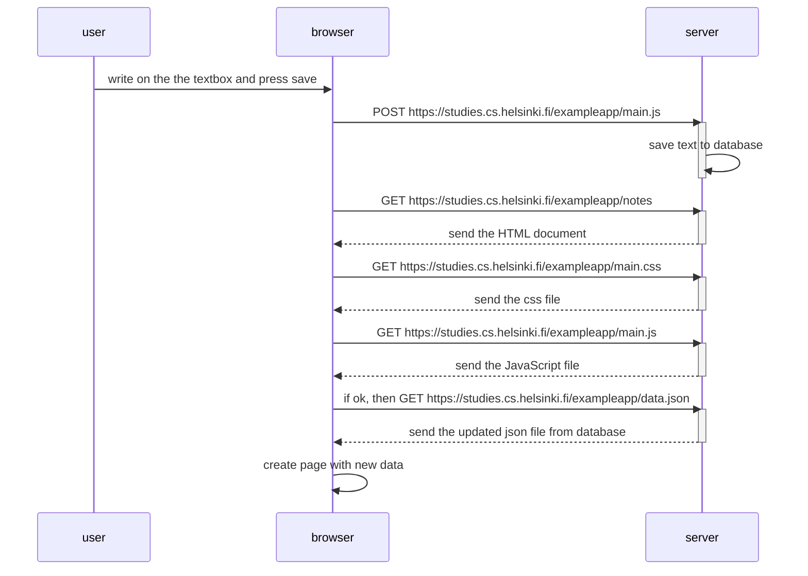

```mermaid
sequenceDiagram
    participant user
    participant browser
    participant server

    user->>browser: write on the the textbox and press save
    browser->>server: POST https://studies.cs.helsinki.fi/exampleapp/main.js
    activate server
    server->>server: save text to database
    deactivate server

    browser->>server: GET https://studies.cs.helsinki.fi/exampleapp/notes
    activate server
    server-->>browser: send the HTML document
    deactivate server
    
    browser->>server: GET https://studies.cs.helsinki.fi/exampleapp/main.css
    activate server
    server-->>browser: send the css file
    deactivate server
    
    browser->>server: GET https://studies.cs.helsinki.fi/exampleapp/main.js
    activate server
    server-->>browser: send the JavaScript file
    deactivate server

    browser->>server: if ok, then GET https://studies.cs.helsinki.fi/exampleapp/data.json
    activate server
    server-->>browser: send the updated json file from database
    deactivate server
    browser->>browser: create page with new data
```